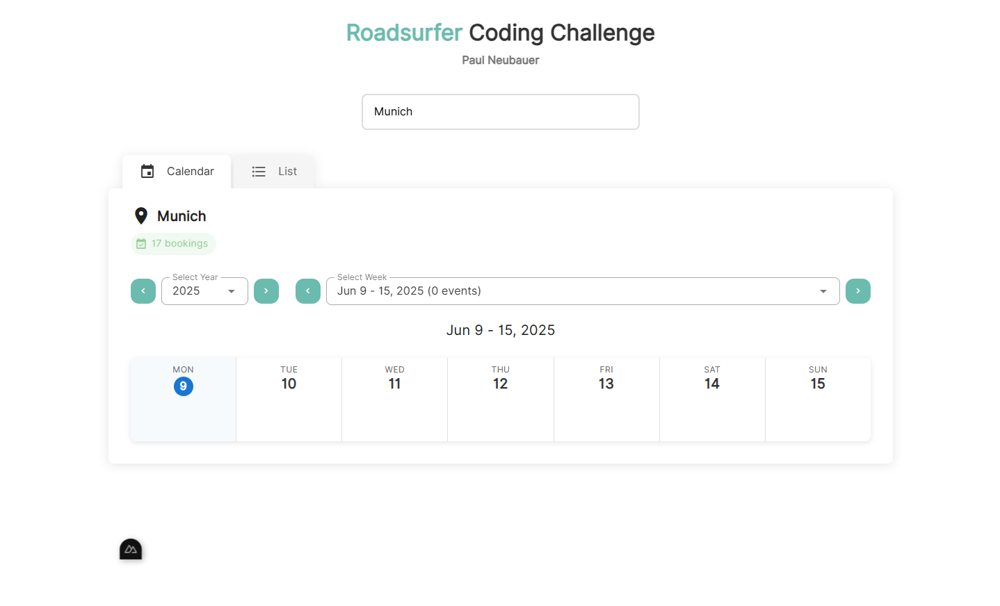
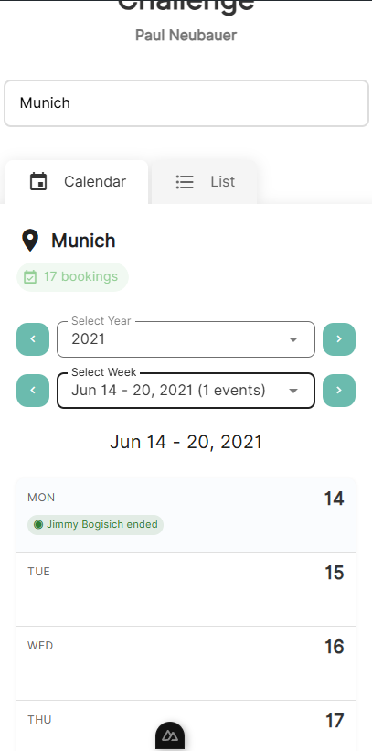

# Coding Challenge

## Paul Neubauer

!! not hosted on GitHub Pages cause it has Nuxt.js API endpoints, so please run local !!





---

# RoadSurfer Station Calendar Management System

A modern Vue 3/Nuxt 3 application for managing station calendars and bookings

## Features

- 📅 Interactive calendar view for station bookings
- 🏢 Station selection and management
- 📱 Fully responsive design (mobile-friendly)
- 🎯 Clickable booking chips with detailed modal views
- 🔍 Real-time booking information display
- 🧪 Comprehensive test coverage (107+ tests)

## Setup

Make sure to install dependencies:

```bash
# npm
npm install

# pnpm
pnpm install

# yarn
yarn install

# bun
bun install
```

## Available Commands

### Development Server

Start the development server on `http://localhost:3000`:

```bash
npm run dev
```

### Build for Production

Build the application for production:

```bash
npm run build
```

### Generate Static Site

Generate a static version of the application:

```bash
npm run generate
```

### Preview Production Build

Locally preview production build:

```bash
npm run preview
```

### Setup and Preparation

Prepare Nuxt dependencies:

```bash
npm run postinstall
```

### Run Tests

Execute the test suite:

```bash
npm run test
```

## Technology Stack

- **Frontend Framework**: Nuxt 3
- **UI Framework**: Vue 3 with Composition API
- **UI Components**: Vuetify 3
- **State Management**: Pinia
- **Testing**: Jest with Vue Test Utils
- **Icons**: Material Design Icons
- **Styling**: SCSS/Sass

## Project Structure

```
components/
├── calendar/           # Calendar-related components
├── BookingDetailsModal.vue
├── BookingChip.vue
└── StationCalendarView.vue

pages/
└── index.vue          # Main application page

stores/
└── stations.ts        # Pinia store for station management

server/
├── api/               # API endpoints
└── utils/             # Server utilities

tests/
└── __tests__/         # Comprehensive test suite
```

## Development

The application features a modern, responsive design that works seamlessly on both desktop and mobile devices. The calendar interface allows users to view and interact with station bookings through an intuitive click-to-view system.

Key functionality includes:

- Station selection dropdown
- Calendar navigation (week/year views)
- Interactive booking chips
- Modal dialogs for booking details
- Full mobile responsiveness

Check out the [Nuxt documentation](https://nuxt.com/docs/getting-started/introduction) to learn more about the framework.
